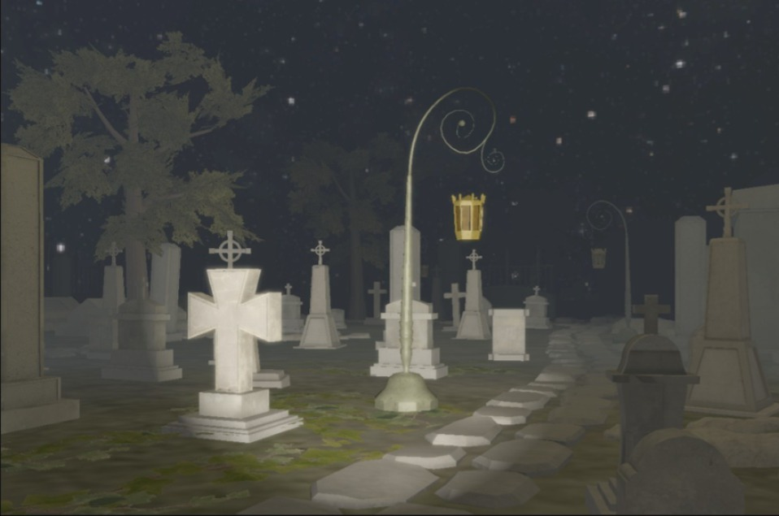
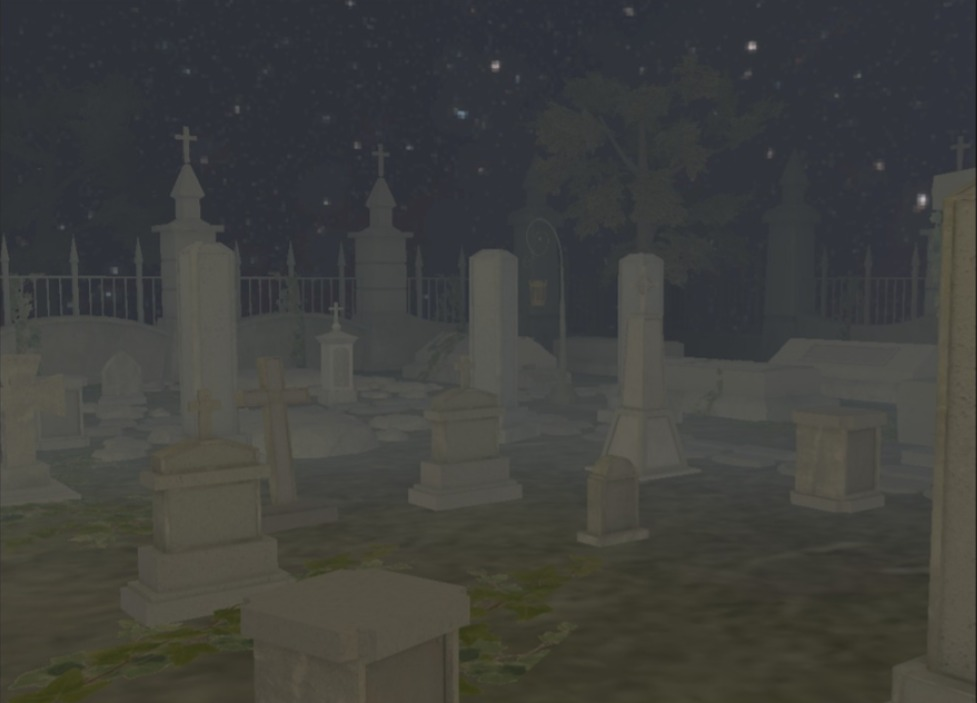
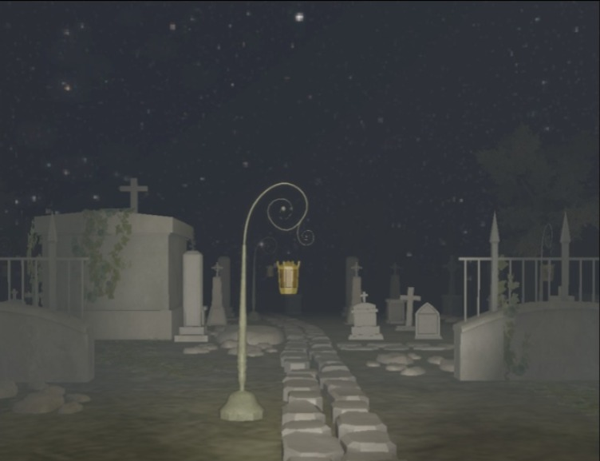

# TOIS-Project-S

T.O.I.S: Project S is a first-person 3D experience set in a small cemetery under the light of a full moon. Rather than focusing on map size, the project emphasizes atmosphere, visual coherence, and environmental immersion.

Players can explore a carefully crafted graveyard surrounded by old tombstones, wrought-iron fences, trees, and dim lanterns whose light pierces through the darkness. Combined with ambient audio and dynamic lighting, the scene aims to create a mysterious and unsettling nighttime environment.


## Video Demonstration

Check out the project in action! You can watch our program and feature demonstration video here:
* [Watch the Video Demo on YouTube](https://www.youtube.com/watch?v=N8U0SuYdhl4)

##  Screenshots

Here are some previews of the environment, lighting effects, and assets inside the cemetery scene:

| Gameplay View |Gameplay View 2 | Dynamic Lighting & Atmosphere |
| ------------- | ----------------------------- |-------------------------------------------|
|  |  |   |

## Features

* **First-Person Camera System**
* **Dynamic Lighting System**
    * Point lights and Spotlights
    * Flashlight attached to the player
* **Skybox Support**
    * Cubemap skyboxes and Spherical skyboxes
* **Model Loading through Assimp**
    * OBJ and GLTF support
* **Environmental Audio System**
* **Interactive Menu System**
* **Collision Detection**
    * Camera-to-mesh collision handling
* **Custom OpenGL Shader Pipeline**


## Technologies

* **Language:** C++
* **Graphics API:** OpenGL 3.3 Core Profile
* **Windowing & Input:** GLFW
* **Extension Loader:** GLEW
* **Mathematics:** GLM
* **Asset Loading:** Assimp
* **Texture Loading:** SOIL2


##  Getting Started (Local Setup)

Follow these step-by-step instructions to clone the repository, set up dependencies, and run the project locally on your machine.

### Prerequisites
* **Visual Studio** (2022 recommended) with the *Desktop development with C++* workload installed.
* **Git** installed on your system.

  ### Step 1: Clone the Repository
Open your terminal or Git Bash and run the following command:
```bash
git clone ttps://github.com/SebasNL-str/TOIS-Project-S.git
cd TOIS-Project-S
```

### Step 2: Open the Project

1. Open Visual Studio.

2. Select Open a project or solution.

3. Browse to the cloned directory and select the `.sln` (Solution) file or the main project folder.

### Step 3: Configure Dependencies & Build

1. Make sure the solution configuration is set to Debug or Release and target architecture is x64.

2. Ensure that the project working directory is set correctly so the executable can locate the `Resources/` folder.

3. Press `Ctrl + Shift + B` to build the solution.

### Step 4: Run the Project
1. Press `F5` (or click the Start Debugging button) in Visual Studio to launch the cemetery experience.

## System Requirements

| Component        | Minimum                               | Recommended                             |
| ---------------- | ------------------------------------- | --------------------------------------- |
| CPU              | Intel Core i5-2400 / AMD Ryzen 3 1200 | Intel Core i5-10400F / AMD Ryzen 5 3600 |
| GPU              | NVIDIA GT 1030 / AMD Radeon R7 370    | NVIDIA GTX 1650 / AMD Radeon RX 6600    |
| RAM              | 8 GB                                  | 16 GB                                   |
| Operating System | Windows 11 64-bit                     | Windows 11 64-bit                       |
| Storage          | 550 MB available space                | 550 MB available space                  |


## Controls

| Key     | Action            |
| ------- | ----------------- |
| W A S D | Move              |
| Mouse   | Look around       |
| ESC     | Open/Close menu   |
| F       | Toggle flashlight |


## Authors

This project was developed by students of the Universidad Nacional de Ingeniería (UNI), as part of the Computer Graphics course:

- [Narváez Sebastian](https://github.com/SebasNL-str)
- [Ortiz Bradly](https://github.com/cBOr50)
- [Brenes Michael](https://github.com/EndministratorI)


## License

[](https://choosealicense.com/licenses/mit/) 

## Acknowledgements

This project was developed as a graphics programming and real-time rendering project, combining custom rendering systems, scene management, collision handling, lighting, and asset loading techniques using modern OpenGL.


